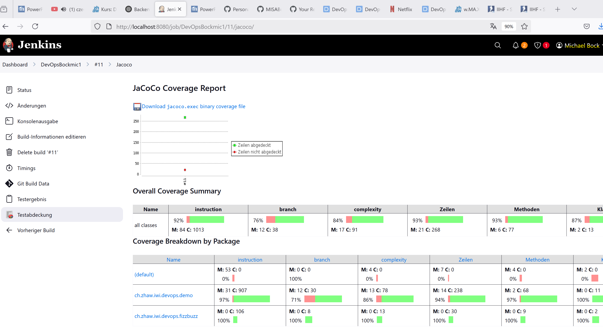

# DevOps 07 CI1

## Lernjournal

ich habe mal als erstes das Jenkins Image gepulled: ()

desweiteren habe ich das plugin installiert: ()

Ihc habe das Projekt gemäss Anelitung erstellt und dann das Github-Token an Jenkins übergeben:() () 

ich hatte noch ein Problem mit Execution Rechten wenn ich das Build über Jenkins gestartet habe. das habe ich dann noch kurz gefixed mit folgendem: ()

nach einigem hin und her konnte ich das Porjekt korrekt laufen lassen: () ()

desweiteren Habe ich das Nodejs Plug für Jenkins installiert: ()

auch zu meiner Umgebung habe ich NodeJS hinzugefügt: ()

einen Execute Shell welche beim Buildverfahren erfolgen soll hinzugefügt: ()

Danach habe ich das Projekt nochmal gebaut: ()

Zum Post Build habe ich noch die JUnit-Test hinzugefügt: ()

Als nächstes habe ich noch das Jacoco Plugin installiert: ()

Hier der Coverage Report zu sehen: () 